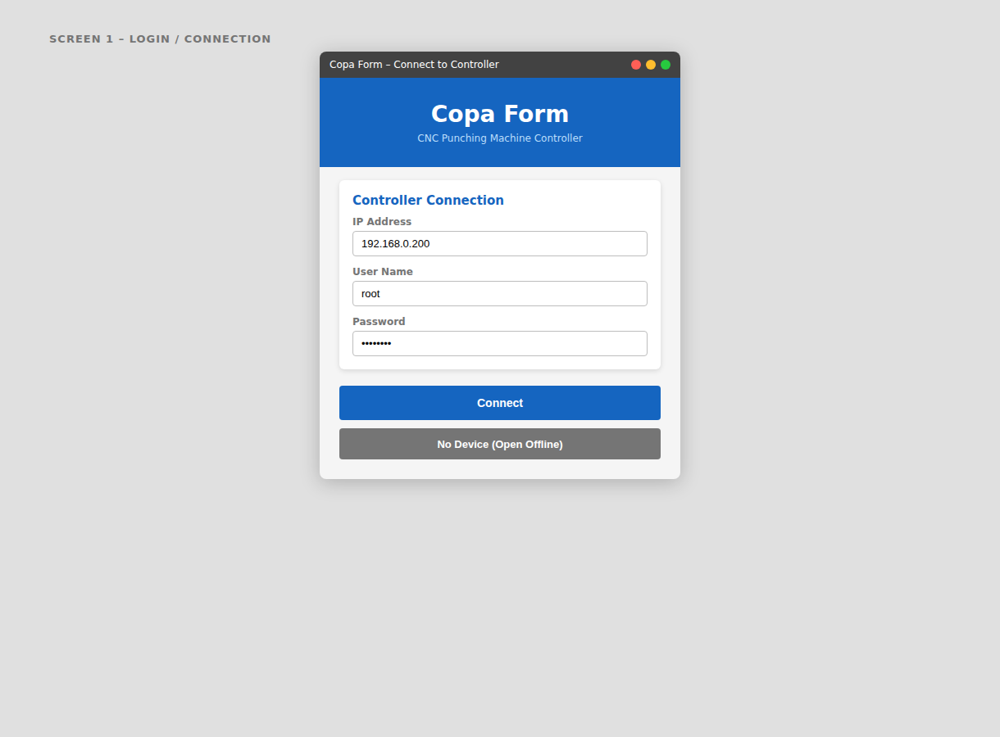
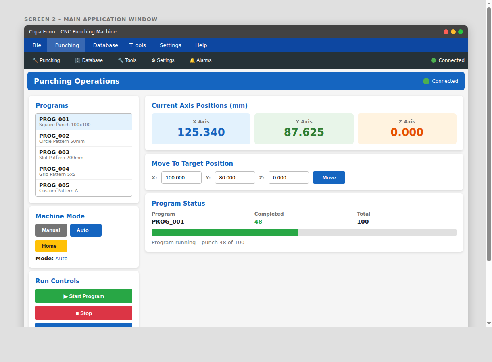
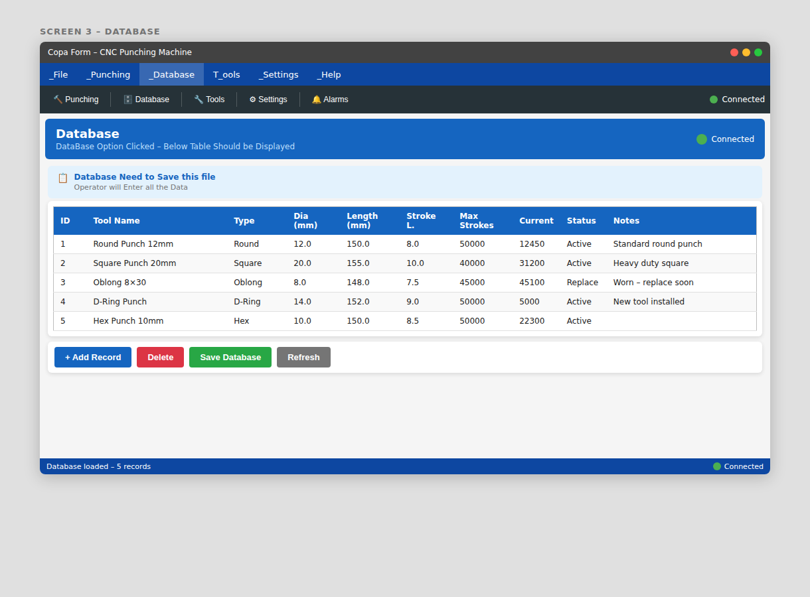
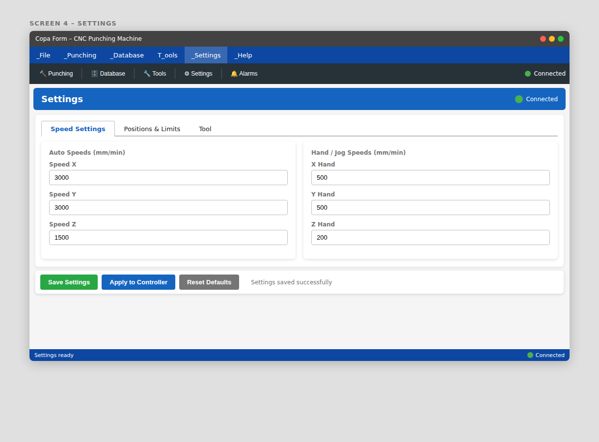
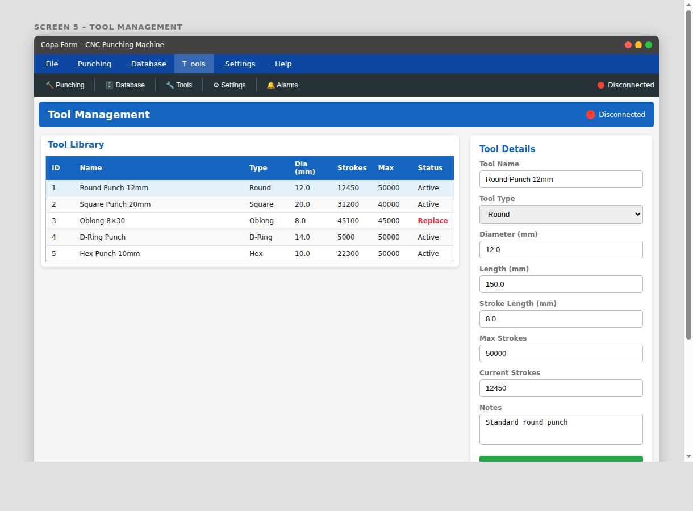
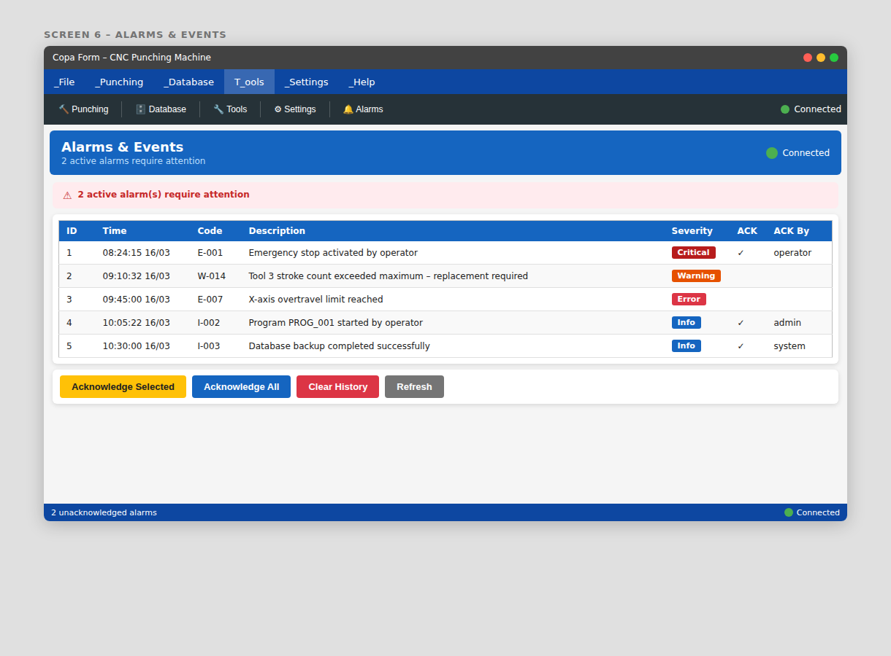
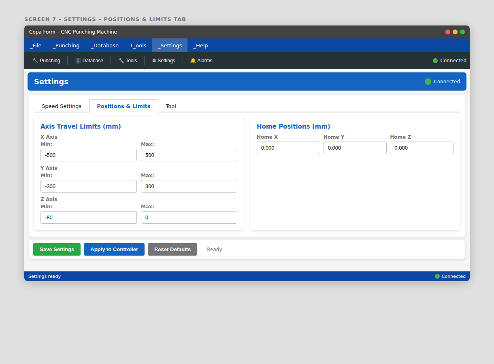

# Copa Form GUI – CNC Punching Machine Controller

A complete **.NET 8 WPF** desktop application for controlling a CNC punching machine via a network-connected Delta Tau controller.

## Technology Stack

| Layer | Technology |
|-------|-----------|
| UI Framework | WPF (.NET 8, `net8.0-windows`) |
| Architecture | MVVM via `CommunityToolkit.Mvvm` |
| Dependency Injection | `Microsoft.Extensions.DependencyInjection` |
| Settings Persistence | JSON file (`%APPDATA%\CopaFormGui\settings.json`) |

## Building

```bash
dotnet build CopaFormGui/CopaFormGui.csproj
dotnet run --project CopaFormGui/CopaFormGui.csproj
```

## Program Editor – 2D & 3D Punch Preview

The Program Editor screen includes a live punch-hole visualisation panel with two tabs:

| Tab | What it shows |
|-----|---------------|
| **2D Punch Preview** | Light-blue canvas with a white sheet-plate rectangle. Each punch step is drawn as a red circle, auto-scaled and centred. X/Y axis arrows in the lower-left corner. |
| **3D Punch Preview** | Dark-background `Viewport3D` perspective scene: grey steel slab + red punch-marker cylinders. Selected step highlights yellow. X/Y/Z axis labels shown. Uses WPF-native 3-D – no extra packages. |

The preview updates automatically whenever a step is added, edited, saved, or deleted.

| 2D Preview | 3D Preview |
|:---:|:---:|
|  |  |

## Publish EXE (Windows)

```bash
dotnet publish CopaFormGui/CopaFormGui.csproj \
	-c Release \
	-r win-x64 \
	-p:PublishSingleFile=true \
	--self-contained false
```

Output executable:

`CopaFormGui/bin/Release/net8.0-windows/win-x64/publish/CopaFormGui.exe`

## Machine-Locked Licensing

The app now validates a signed `license.json` at startup and only runs when:

- `MachineId` in license matches current machine fingerprint.
- Signature is valid against embedded public key.
- Product matches `CopaFormGui`.
- License is not expired (if `ExpiresUtc` is set).

License lookup order:

- `%ProgramData%\\CopaFormGui\\license.json`
- App folder: `license.json`

When license is missing/invalid, the app shows the current machine ID. Send that ID to your dev team for activation.

## Dev Team: Key-Pair Setup (OpenSSL)

Generate RSA keys (recommended 3072 bits):

```bash
openssl genpkey -algorithm RSA -pkeyopt rsa_keygen_bits:3072 -out copa_private_key.pem
openssl rsa -pubout -in copa_private_key.pem -out copa_public_key.pem
```

- Keep `copa_private_key.pem` only with dev/licensing team.
- Copy the content of `copa_public_key.pem` into `CopaFormGui/Services/LicenseCrypto.cs` (`PublicKeyPem`).

## Dev Team: Key-Pair Setup (.NET / PowerShell)

Alternative without OpenSSL:

```powershell
pwsh -NoProfile -Command "$rsa=[System.Security.Cryptography.RSA]::Create(3072); [IO.File]::WriteAllText('copa_private_key.pem',$rsa.ExportRSAPrivateKeyPem()); [IO.File]::WriteAllText('copa_public_key.pem',$rsa.ExportSubjectPublicKeyInfoPem())"
```

## Dev Team Workflow: Issue License for One Machine

1. Get target machine ID on customer system:

```powershell
powershell -NoProfile -Command "(Get-ItemProperty -Path 'HKLM:\SOFTWARE\Microsoft\Cryptography' -Name MachineGuid).MachineGuid"
```

2. Generate signed license on dev machine:

```bash
dotnet run --project CopaLicenseGenerator -- \
  --machine-id "<TARGET_MACHINE_ID>" \
  --customer "<CUSTOMER_NAME>" \
  --private-key "<PATH_TO_PRIVATE_KEY_PEM>" \
  --out "./license.json" \
  --expires-utc "2027-12-31T23:59:59Z"
```

3. Deliver that `license.json` to installer package or deployment folder.

## Installer Step: Copy License to ProgramData Automatically

Use the post-install script:

- `installer/Copy-LicenseToProgramData.ps1`

Example command (run at end of installer):

```powershell
powershell.exe -ExecutionPolicy Bypass -File ".\Copy-LicenseToProgramData.ps1" -InstallDir "C:\Program Files\CopaFormGui"
```

This copies:

- source: `C:\Program Files\CopaFormGui\license.json`
- target: `%ProgramData%\CopaFormGui\license.json`

## Default Connection Credentials

| Field | Default |
|-------|---------|
| IP Address | 192.168.0.200 |
| User Name | root |
| Password | deltatau |

---

## Screen Previews

### Screen 1 – Login / Connection
Pre-filled credentials, masked password, **Connect** and **No Device (Offline)** buttons.



---

### Screen 2 – Main Window (Punching Operations Active)
Full menu bar (File / Punching / Database / Tools / Settings / Help), toolbar with icons, axis position display, program list, mode buttons, E-Stop, and green/red controller status indicator.



---

### Screen 3 – Database
Tool records DataGrid with all columns (ID, Name, Type, Diameter, Length, Stroke Length, Max Strokes, Current Strokes, Status, Notes). Add / Delete / Save / Refresh actions.



---

### Screen 4 – Settings (Speed Settings Tab)
Auto speeds and hand/jog speeds for X, Y, Z axes. Tabbed interface with Positions & Limits and Tool tabs.



---

### Screen 5 – Tool Management
Split layout: tool library DataGrid on the left, detail edit panel on the right. Reset strokes, add/delete tools.



---

### Screen 6 – Alarms & Events
Severity-coloured alarm table (Critical / Error / Warning / Info), active alarms banner, acknowledge selected/all, clear history.



---

### Screen 7 – Settings (Positions & Limits Tab)
Axis travel limits (min/max for X, Y, Z) and home positions configuration.



---

### Screen 8 – Program Editor: 2D Punch Preview

The Program Editor bottom panel includes a **2D Punch Preview** tab.  
It renders the sheet plate as a white rectangle on a light-blue canvas with all punch-hole
positions drawn as red circles, automatically scaled and centred to fit.
X/Y axis arrows appear in the lower-left corner.  
The preview updates live whenever a step is added, edited, saved, or deleted.


---

### Screen 9 – Program Editor: 3D Punch Preview

Switch to the **3D Punch Preview** tab for a perspective view of the same program.  
The steel sheet is rendered as a 3-D slab (grey) with red cylinders at every punch position.
Selected steps highlight in yellow. The scene uses WPF native `Viewport3D` — no
third-party libraries required. X / Y / Z axis labels are shown at the edges of the scene.


---

## Project Structure

```
CopaFormGui/
├── Models/
│   ├── AlarmRecord.cs
│   ├── ConnectionSettings.cs
│   ├── LicenseFile.cs
│   ├── MachineSettings.cs
│   ├── PunchPreviewPoint.cs
│   ├── PunchProgram.cs
│   └── ToolRecord.cs
├── Services/
│   ├── IControllerService.cs / ControllerService.cs
│   ├── ILicenseService.cs / LicenseService.cs
│   ├── LicenseCrypto.cs
│   ├── LicenseValidationResult.cs
│   └── ISettingsService.cs  / SettingsService.cs
├── ViewModels/
│   ├── LoginViewModel.cs
│   ├── MainViewModel.cs
│   ├── ProgramEditorViewModel.cs
│   ├── PunchingViewModel.cs
│   ├── DatabaseViewModel.cs
│   ├── SettingsViewModel.cs
│   ├── ToolManagementViewModel.cs
│   └── AlarmViewModel.cs
├── Views/
│   ├── LoginWindow.xaml
│   ├── ProgramEditorView.xaml
│   ├── ProgramEditorView.xaml.cs
│   ├── PunchingView.xaml
│   ├── DatabaseView.xaml
│   ├── SettingsView.xaml
│   ├── ToolManagementView.xaml
│   └── AlarmView.xaml
├── Converters/
│   └── Converters.cs
├── App.xaml          (global styles + DI bootstrap)
└── MainWindow.xaml   (shell with menu, toolbar, status bar)
```
